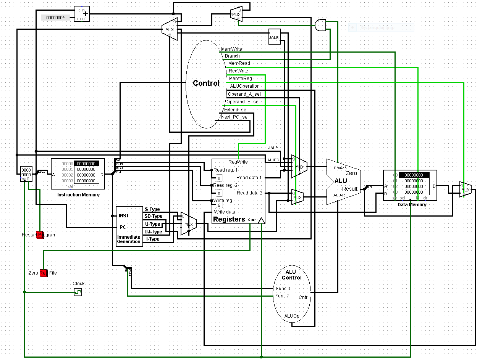

# Lab 3: SingleCycle-RV32i

## Lab 简介

本 Lab 旨在让大家完成一个单周期 CPU 设计，补全 ALUControl，Control，Reg，DataMem，ImmGen 单元。

## 前期准备

同 Lab 1

## 实验步骤

### 指南

clone 仓库

```bash
git clone https://github.com/CA-2021Spring-Lab/SingleCycle-RV32i
# or git clone https://gitee.com/ca-2021-spring-lab/SingleCycle-RV32i
cd SingleCycle-RV32i
```

进入仓库，拉取镜像

校园网或校内 VPN 拉取镜像命令

```bash
docker pull 10.176.122.240/lab1/sbt:latest
docker tag 10.176.122.240/lab1/sbt:latest sbt
```

公网环境拉取镜像命令

```bash
docker pull hoshinotouko/sbt:latest
docker tag hoshinotouko/sbt:latest sbt
```

pull 完成后，运行 `docker-compose up -d` 启动实验环境，然后运行 `docker exec -it sbt bash` 进入实验容器。

实验结束后，执行 `exit` 退出容器，并执行 `docker-compose down` 关闭容器。

直接在仓库中的 `./workspace/` 文件夹下编辑代码，对应位置已经映射到容器中的 `/workspace` 文件夹。请参考 chisel3、scala 编程手册，按照要求编写。

### 程序执行和测试

在容器中运行 `sbt` 进入环境，执行 `test:runMain rv32i.Tester Top` 运行测试。初次运行 sbt 时，可能需要一段时间下载运行环境。

### 实验要求

将 Lab 1 设计的 PC 模块填入，然后完成挖空的若干模块 ALUControl，Control，Reg，DataMem，ImmGen，并使用自己生成的指令集测试。

Chisel 文档参考

- https://www.chisel-lang.org/chisel3/docs/introduction.html

DEBUG 可以使用在线的 RISC-V 模拟器

- Venus: https://venus.cs61c.org/
- https://ascslab.org/research/briscv/simulator/simulator.html

连线参考图如下



## 评分标准

- 完成上述实验 (10/10)
- 使用自己生成的指令集进行测试 （附加）(2/10)

